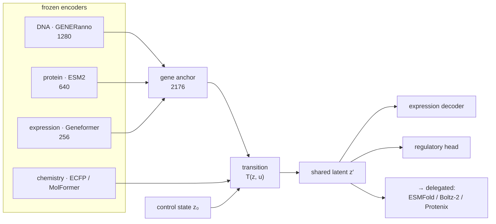

<h1 align="center">luria-aido</h1>

<p align="center">
  <em>A cell world model for K-562 — and the controls that say which parts of it work.</em>
</p>

<p align="center">
  
  
  
</p>

---

Three readout families — gene knockout, small molecule, regulatory sequence —
decode from **one shared latent state**. Write a perturbation once and every
readout sees it. That is the claim that separates a world model from three
predictors behind a common `import`, and it is testable: improving one family
must not degrade the others.

It holds. Swapping F1's dataset left F2's and F3's metrics unchanged.

The rest of this README is about something less comfortable. Every number here
ships with the null that says whether it means anything, and by that standard
**one leg is at specialist parity, one carries real but weak signal, and one
does not work at all.**

## Quickstart

```python
from luria_aido import Cell

cell = Cell("K-562")

ko = cell.clone()
ko.gene_knockout("ABL1")
ko.get_expression()          # pd.Series over 6584 genes

drug = cell.clone()
drug.small_molecule_perturbation("CC1=C(C=C(C=C1)NC(=O)...")
drug.get_expression()        # runs — but see "F2 does not read the molecule"
```

`examples/design_loop.py` runs the published in-context design loop end to end
(16 steps, 0 failures).

## Scoreboard

`gap_z` is how far the model sits from a **shuffle null** — permute the
condition→target correspondence, 30 draws, measure in null-SDs. It is the only
number that says the model is using the perturbation at all. A model *trained*
on shuffled labels scores **0.68** (F1) and **2.65** (F2); those are the bars.

| family | `gap_z` | ours | specialist | verdict |
|:--|--:|--:|--:|:--|
| **F3** · regulatory sequence → activity | **59 – 71** | corr_hk 0.792 ± 0.003 | GENERator 0.80 | **at parity** |
| **F1** · gene KO → expression | **6.8 – 8.5** | pearson 0.246 ± 0.003 | GEARS 0.564 | real signal, 2× below |
| **F2** · molecule → expression | 3.6 – 4.2 | R² 0.041 ± 0.006 | chemCPA 0.37 | **does not work** |

F1 also clears both trivial floors — MSE 0.921 < train-mean 0.971 < zero 1.054.
F2 does not clear the shuffled-label bar of 2.65.

> The GEARS number was produced locally with official weights on the simulation
> split (107 test perturbations). In that same run **GEARS scored below its own
> train-mean control** (0.564 vs 0.5786). The bar in this task is low; that is
> the field's state, not a favourable choice of baseline.

## F2 does not read the molecule

The usual way to report a design loop is: generate candidates, measure how many
of the reference drug's differentially-expressed genes they recover, publish the
percentage. Here is that number for our model, **with negative controls** —
which is the part that is usually missing.

Reference: imatinib, top-200 DE genes.

| molecule | DEG recovery | cosine to reference |
|:--|--:|--:|
| glucose | **68.0 %** | +0.93 |
| urea | 64.0 % | +0.91 |
| ibuprofen | 62.0 % | +0.91 |
| aspirin / caffeine | 53.0 % | +0.86 |
| scrambled SMILES | 44 – 51 % | +0.85 |
| ethanol | 41.5 % | +0.78 |
| **dasatinib** — a real ABL1 inhibitor | **35.5 %** | +0.79 |

**The ordering is inverted.** Glucose beats the kinase inhibitor; a corrupted
SMILES string beats it too. Every molecule correlates +0.5 … +0.93 with the
reference because they all predict the same shared stress axis.

A DEG-recovery percentage without these controls carries no information. Ours
would look publishable — one designed candidate reaches 61.5 % — and it would
mean nothing.

## Why F2 fails, and why it is not an architecture problem

F1 was in exactly this position with **137** training conditions. It was fixed
by data alone:

```
F1   Norman 137 conditions  →  Replogle 836 conditions
     gap_z 3.7 → 6.8–8.5,  clears train-mean and zero
```

Eighteen architecture variants and an 810-epoch run changed nothing measurable.
Two-stage shared/residual decomposition, a frozen-feature probe floor,
per-gene token decoding, a per-cell latent, anchor whitening, capacity
scaling — all at or below baseline, several degrading F3. **The dataset swap
was the only change that moved the metric.**

F2 has **166 unique training drugs** and no equivalent dataset exists:

| candidate | why it does not fit |
|:--|:--|
| L1000 phase 1 | 17,201 compounds, 70 cell lines, **no K562**; bulk 978-gene, different control convention |
| Tahoe-100M | 100 M cells, 1,100 compounds, but its 102 lines are solid tumours — **no K562** |

Nothing public is simultaneously K-562, single-cell, and large on the chemical
side. That is a data gap, not a modelling gap, and it is recorded in
[`docs/DATA.md`](docs/DATA.md) so it is not re-derived.

## Architecture



Encoders are frozen and declared as dependencies — they are not redistributed.
The trained part is the integration: projections, the transition operator, and
the per-modality decoders. All readouts decode from the same `z′`; no family
keeps a private branch. That constraint is what makes criterion ① falsifiable.

## API

| write | |
|:--|:--|
| `clone()` | real copy of state; perturbations compose |
| `gene_knockout(gene)` · `gene_overexpression(gene)` | |
| `small_molecule_perturbation(smiles)` | |

| read | |
|:--|:--|
| `get_expression()` | `pd.Series` over 6584 genes |
| `get_regulatory_activity(sequence)` | the leg at specialist parity |
| `get_protein_structure(target, molecule=None)` | `delegated:` ESMFold / Boltz-2 / Protenix |
| `get_protein_ligand_interactions(molecule, target=None)` | `delegated:` |
| `get_cell_age()` · `state` · `history` | |
| `design_molecule_for_target(target)` | `delegated:` WarmMolGenOne — returns a provenance dict, unwrap `["value"][0]["smiles"]` |

Readouts that are not implemented **raise** rather than approximate. An
approximation under a real method's name is a different method reporting that
method's number.

## Install

```bash
pip install -e .                          # core: Cell, expression, regulatory
pip install -e ".[encoders,structure]"    # frozen encoders + delegated folding
pytest tests/                             # 5 smoke tests, no artifacts needed
```

Weights and anchor tables ship as a release asset (164 MB, includes the delivered
checkpoint at 3 seeds). Point `LURIA_AIDO_DATA` at
it — one command in [`docs/DATA.md`](docs/DATA.md). Every path is an environment
variable with a default, and a test fails the build if a developer's absolute
path survives into the package.

On a shared GPU, availability is decided by a **real allocation**:
`torch.cuda.is_available()` returns `True` on a device that will refuse you a
context.

## Known limits

Full list in [`MODEL_CARD.md`](MODEL_CARD.md). The ones that change how you
should use it:

1. **F2 must not be used for anything that depends on which molecule was given.**
2. **F3 depends on an `f3_init` warm start.** Without it, correlation is
   0.15–0.40 and degrades further under joint training.
3. **The DNA leg of the anchor is near-constant** (pairwise cosine 0.995). The
   three legs are structurally present but carry very unequal information — this
   is why the perturbation atlas has effective rank 1.95.
4. **Cross-scale propagation and multi-round experiments are untested.** They
   are also not claimed.
5. **No wet-lab validation of any prediction.**

## License

MIT. Frozen encoders and delegated tools carry their own licenses and are not
redistributed here.
