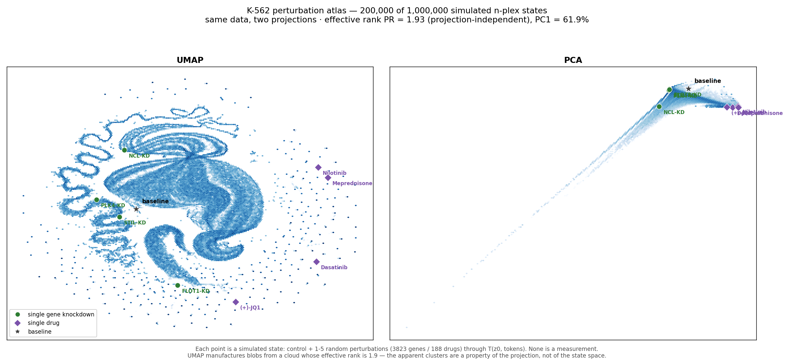
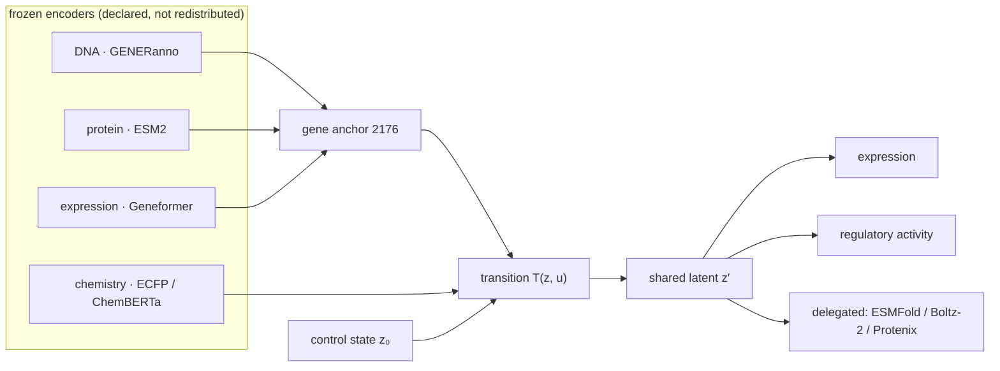

<h1 align="center">luria-aido</h1>

<p align="center"><em>A cell world model for K-562 — built to be checked, and reporting what the checks say.</em></p>

<p align="center">
  
  
  
</p>

---

Every engineering discipline simulates before it builds. Biology has no such
framework, and the reason is not that nobody has tried — it is that a cell is
one system, while the models are many, each built around a single assay. A
simulator has to hold **one state** that persists across manipulations, accept
interventions that modify it, and decode observations on demand.

That is what this is. It is also, deliberately, a report on how far that gets
you: **each capability below ships with the control that says whether it works,
and by that standard one of three holds, one is untested, and one fails.**

## Quickstart

```python
from luria_aido import Cell

cell = Cell("K-562")

ko = cell.clone()
ko.gene_knockout("ABL1")
ko.get_expression()          # pd.Series over 6584 genes
```

```bash
pip install -e .
mkdir -p ~/.cache/luria-aido && cd ~/.cache/luria-aido
gh release download v0.1.0 -R omicverse/luria-aido -p 'luria-aido-artifacts-*.tar.gz'
tar xzf luria-aido-artifacts-0.1.0.tar.gz && export LURIA_AIDO_DATA=$PWD
```

## The three world-model claims, measured

A world model is supposed to buy three things that separate predictors cannot.
Each is testable, so each was tested.

### C1 · Coherent multimodal readouts — **partial**

All readouts decode from one `z′`; no family keeps a private branch. Swapping
F1's dataset (Norman → Replogle) left F2's gap and F3's correlation unchanged,
which is the falsifiable form of "shared state" and it holds.

But coherence is only worth something if each readout carries information. One
does not — see the negative controls below.

### C2 · Multiscale propagation — **untested, and not claimed**

Editing a regulatory sequence and reading the consequence at the pathway level
is the interesting version of this. F3 (sequence → activity) works; wiring its
output into `z` is not done. We do not report a number for C2.

### C3 · Continuous multi-turn experimentation — **fails**

The claim is that every state is a starting point and there is no limit on how
many perturbations you can apply. Mechanically true here too. Measured:

| step | ‖z − z₀‖, sequential ribosomal KD | ‖z − z₀‖, **same gene repeated** |
|--:|--:|--:|
| 1 | 25.6 | 25.6 |
| 2 | 50.1 | 51.5 |
| 3 | 68.3 | 77.8 |
| 4 | 83.8 | 104.5 |
| 5 | 120.2 | 131.5 |

For scale, the whole 1M-state atlas has a median distance of 1.94 from baseline
and a 99.9th percentile of 25.6.

Two things are wrong here. **Drift is unbounded** — each step adds a constant,
nothing saturates, whereas a real cell dies. And **knocking down the same gene
five times keeps moving the state**: `T(z, u)` has no idempotence and no memory
of what has already been perturbed. Multi-turn runs, but it does not mean
anything yet.

## Scoreboard

`gap_z` is distance from a shuffle null (permute the condition→target
correspondence, 30 draws) in null-SDs. It is the only number that says the
model uses the perturbation at all. Reference: a model **trained** on shuffled
labels scores 0.68 (F1) and 2.65 (F2).

| family | `gap_z` | ours | specialist | verdict |
|:--|--:|--:|--:|:--|
| **F3** · regulatory sequence → activity | **59 – 71** | corr_hk 0.792 ± 0.003 | GENERator 0.80 | **at parity** |
| **F1** · gene KO → expression | **6.8 – 8.5** | pearson 0.246 ± 0.003 | GEARS 0.564 | real signal, 2× below |
| **F2** · molecule → expression | 3.6 – 4.2 | R² 0.041 ± 0.006 | chemCPA 0.37 | **does not work** |

F1 clears both trivial floors (MSE 0.921 < train-mean 0.971 < zero 1.054). F2
does not clear the shuffled-label bar of 2.65.

RNA splicing and protein structure are not contested — the first has no data
here, the second is delegated. They are marked as such rather than filled in.

> The GEARS number was produced locally with official weights on the simulation
> split. In that same run **GEARS scored below its own train-mean control**
> (0.564 vs 0.5786). The bar in this task is low, and that is the field's state
> rather than a convenient choice of baseline.

## In-context molecular design, with the controls

The published loop runs end to end here — 16 steps, 0 failures
(`examples/design_loop.py`). One deviation from the snippet as written:
`design_molecule_for_target` returns a provenance dict, so the SMILES must be
unwrapped before it is handed to a perturbation.

The usual way to report such a campaign is the fraction of the reference drug's
differentially-expressed genes that candidates recover. Reference: imatinib,
top-200 DE genes. **With negative controls:**

| molecule | DEG recovery | cosine to reference |
|:--|--:|--:|
| glucose | **68.0 %** | +0.93 |
| urea | 64.0 % | +0.91 |
| ibuprofen | 62.0 % | +0.91 |
| aspirin / caffeine | 53.0 % | +0.86 |
| scrambled SMILES | 44 – 51 % | +0.85 |
| **dasatinib** — a real ABL1 inhibitor | **35.5 %** | +0.79 |

**The ordering is inverted.** Glucose beats the kinase inhibitor; so does a
corrupted SMILES string. Every molecule correlates +0.5…+0.93 with the
reference because all of them predict the same shared stress axis.

Our own best designed candidate reaches 61.5 %. Reported alone, that number
would look publishable. It means nothing.

## The perturbation atlas, and what a projection can hide

One million simulated n-plex states (1–5 perturbations, 3823 genes / 188 drugs)
through `T(z₀, tokens)`. **None of them is a measurement** — as with any such
atlas, every node is model output.



Same 200,000 states, two projections. The cloud's **effective rank is
PR = 1.93** — a projection-independent property of the covariance. PCA shows
that honestly as a near-1D band; UMAP folds the same band into ribbons that
read as clusters.

Any figure that presents a state space through UMAP should report its effective
rank alongside, or the reader cannot tell structure from folding.

Two measurements from the same atlas explain the F2 failure one level deeper
than "not enough data":

```
                     centred pairwise cosine    effective rank
ChemBERTa input              −0.020                 21.79
drug tokens (projected)      −0.006                  3.84
T(z₀, tok) displacement      +0.046                  1.97

gene anchor input            −0.011                 65.54
gene tokens (projected)      +0.841                  1.01   ← near rank 1
```

The collapse is not specific to chemistry — the **gene** projection is worse,
compressing a 2176-dimensional three-leg anchor onto essentially one direction.
The gene arm behaves as a scalar "how strong is this knockdown" (displacement
norms span 1.85–35.23) rather than as an encoding of *which* gene. Whether F1's
gap survives that reading is an open question stated in `MODEL_CARD.md`.

## Why F2 fails, and why it is not architecture

F1 was in the same position at **137** training conditions and was fixed by data
alone: Replogle 2022 took it to 836 and `gap_z` from 3.7 to 6.8–8.5. Eighteen
architecture variants and an 810-epoch run moved nothing measurable —
two-stage residual decomposition, a frozen-feature probe, per-gene token
decoding, a per-cell latent, anchor whitening, capacity scaling.

F2 has **166 unique training drugs** and no equivalent dataset exists:

| candidate | why it does not fit |
|:--|:--|
| L1000 phase 1 | 17,201 compounds, 70 cell lines, **no K562**; bulk 978-gene |
| Tahoe-100M | 100M cells, 1,100 compounds, 102 lines — all solid tumours, **no K562** |

Nothing public is simultaneously K-562, single-cell, and large on the chemical
side. Recorded in [`docs/DATA.md`](docs/DATA.md) so the search is not repeated.

## Architecture



The trained, released part is the integration — projections, transition
operator, decoders. Encoders are dependencies.

## API

| write | | read | |
|:--|:--|:--|:--|
| `clone()` | real copy; perturbations compose | `get_expression()` | Series over 6584 genes |
| `gene_knockout(g)` | | `get_regulatory_activity(seq)` | the leg at parity |
| `gene_overexpression(g)` | ⚠ see below | `get_protein_structure(t, mol)` | `delegated:` |
| `small_molecule_perturbation(smiles)` | | `get_protein_ligand_interactions(mol)` | `delegated:` |
| | | `design_molecule_for_target(t)` | `delegated:`; unwrap `["value"][0]["smiles"]` |

⚠ **The model does not distinguish knockout from knockdown from
overexpression.** F1 trained on Replogle CRISPRi only; the token carries gene
identity and nothing else. `gene_overexpression` is present in the API surface
and is not backed by training signal. Norman (CRISPRa) and Replogle (CRISPRi)
share only 5 genes, which is too few to validate a direction embedding — so it
was not added rather than added unvalidated.

Readouts that are not implemented raise rather than approximate.

## Limits

Full list in [`MODEL_CARD.md`](MODEL_CARD.md). The ones that change how you use it:

1. **F2 must not be used for anything that depends on which molecule was given.**
2. **Multi-turn drift is unbounded** — do not chain perturbations and read the endpoint.
3. **F3 depends on an `f3_init` warm start**; without it correlation is 0.15–0.40 and degrades under joint training.
4. **No wet-lab validation of any prediction.**

## What would move this

In order of expected value, not of effort:

- **A K-562 single-cell drug atlas at Replogle's scale.** F1's fix was data; F2 has no equivalent to apply. This is the binding constraint and it is external.
- **A direction-labelled perturbation dataset** (CRISPRa and CRISPRi, same protocol, overlapping genes) so KO/KD/OE can be modelled and *checked*.
- **Saturation in the transition operator**, so multi-turn means something.
- **A benchmark the field owns.** Every number here is self-evaluated, ours and everyone else's.

## License

MIT. Frozen encoders and delegated tools keep their own licenses.
